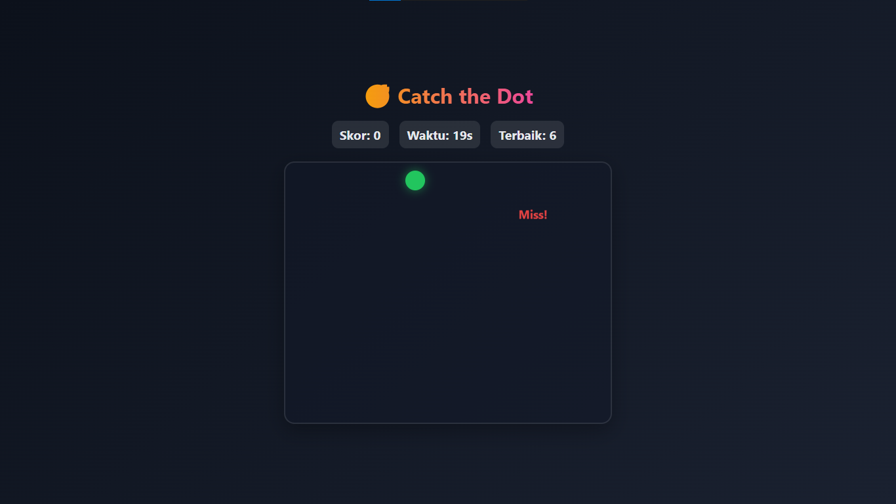
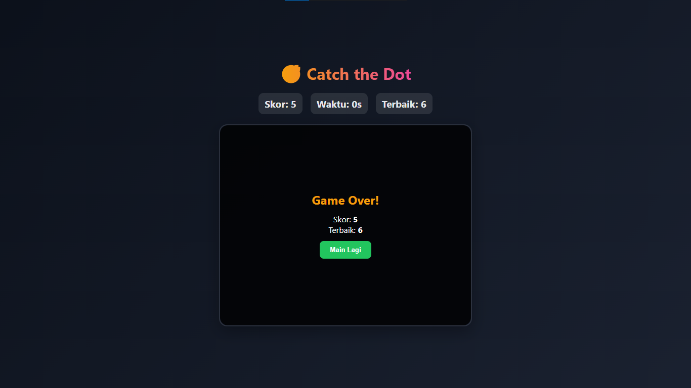

# 🎯 Catch the Dot  
Game sederhana berbasis **HTML, CSS, dan JavaScript**.  
Tugasmu adalah mengejar dan mengklik dot (lingkaran) yang muncul secara acak di arena dalam waktu 30 detik.  

---

## ✨ Fitur
- 🟠 **Dot oranye** → +1 skor  
- 🟢 **Dot hijau** → +2 detik waktu  
- 🔴 **Dot merah** → -1 detik waktu  
- 🕒 Timer 30 detik  
- 🏆 Skor terbaik (**tersimpan otomatis di browser**)  
- ⚡ Animasi klik, efek pop-up, dan indikator "Miss!"  

---

## 🚀 Cara Menjalankan
1. Clone repository ini:
   ```bash
   git clone https://github.com/username/catch-the-dot.git
Masuk ke folder project: cd catch-the-dot
Jalankan game dengan membuka file Game_Dot.html di browser favoritmu.
✅ Tidak perlu instalasi tambahan.

## ⌨️ Cara Bermain
- Klik dot yang muncul di area permainan.
- Kumpulkan skor sebanyak mungkin sebelum waktu habis.
- Hati-hati dengan dot merah yang bisa mengurangi waktu!

## 📸 Screenshot



## 🤳 Main Online
https://rahmayani-maya.github.io/Game_Catch_The_Dot/Game_Dot.html
